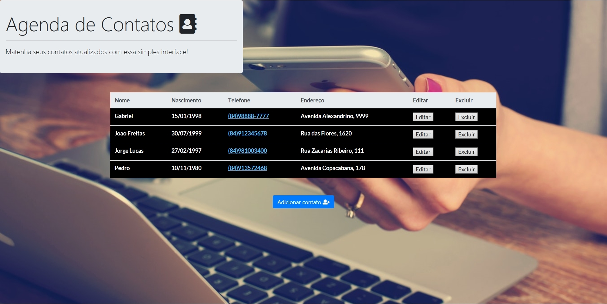

# personal-agenda
CRUD application using MySQL and PHP

Instructions for use:

1) Run a mySQL server (for database) and a web apache server (for interpreting php) on your computer.
Sugestion: Use XAMPP softaware.

2) Create a database named "agenda" and, inside of it, a table named "pessoa", on the mySQL server.
Query:
CREATE DATABASE agenda;
CREATE TABLE pessoa(
  id INT PRIMARY KEY AUTO_INCREMENT,
  nome VARCHAR(40),
  nascimento DATE,
  endereco VARCHAR(40),
  telefone VARCHAR(20)
);

3) Run application project on localhost.
Sugestion: Use an IDE (mine was Netbeans).
